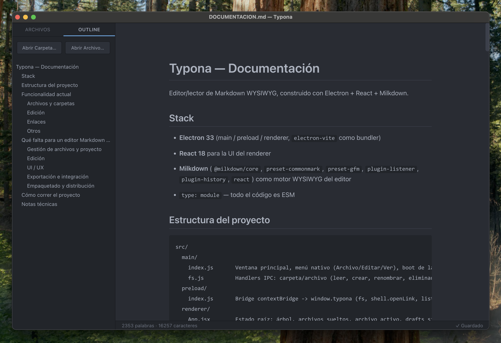

# Typona

Editor y lector de Markdown WYSIWYG para escritorio (macOS, Windows y Linux), construido con Electron, React y Milkdown.

Typona te deja abrir una carpeta o archivos `.md` sueltos y editarlos viendo el resultado formateado en tiempo real, sin tener que mirar el código Markdown crudo.



## Funcionalidades

- Abrir una carpeta y navegar su árbol de archivos `.md`/`.markdown`, o abrir archivos sueltos de cualquier ubicación.
- Multi-ventana: cada carpeta grande puede vivir en su propia ventana.
- Edición WYSIWYG con soporte GFM (tablas, listas de tareas, etc.) e historial de deshacer/rehacer real.
- Menú contextual para dar formato (títulos, listas, citas, código, tablas, enlaces, negrita, cursiva, tachado).
- Navegación entre archivos `.md` enlazados con `Cmd/Ctrl + clic`.
- Outline del documento con scroll sincronizado.
- Crear, renombrar y eliminar archivos/carpetas desde la app.

## Instalación

> El proyecto todavía no tiene releases publicados. Mientras tanto, podés correrlo desde el código fuente siguiendo la sección [Desarrollo](#desarrollo).

Cuando haya versiones publicadas, vas a poder descargarlas desde la sección [Releases](../../releases) de este repositorio. Como la app no está firmada ni notarizada (no requiere cuenta de desarrollador de Apple), macOS va a advertir la primera vez que la abras: hacé **clic derecho → Abrir** para saltear esa advertencia de Gatekeeper.

## Desarrollo

Requisitos: [Node.js](https://nodejs.org/) y npm.

```bash
npm install
npm run dev     # levanta la app en modo desarrollo con hot reload
```

Otros comandos:

```bash
npm run build   # build de producción a /out
npm run start   # corre el build de producción (preview)
npm run dist    # empaqueta un instalador (.dmg / .exe / .AppImage) en /dist
```

## Ramas y releases

- `dev`: desarrollo en curso.
- `main`: versión estable. Se actualiza mergeando `dev` mediante Pull Request (cada PR corre un [chequeo de build](.github/workflows/build-check.yml) automático). Cada push a `main` dispara un [workflow](.github/workflows/release.yml) que sube el patch version, genera el `.dmg` y publica un [Release](../../releases) en GitHub.

## Stack

- [Electron](https://www.electronjs.org/) 33
- [React](https://react.dev/) 18
- [Milkdown](https://milkdown.dev/) (motor de edición WYSIWYG sobre ProseMirror)
- [electron-vite](https://electron-vite.org/) como bundler
- [electron-builder](https://www.electron.build/) para generar los instaladores

## Licencia

[MIT](LICENSE) © [oscarweb](https://github.com/oscarweb)
